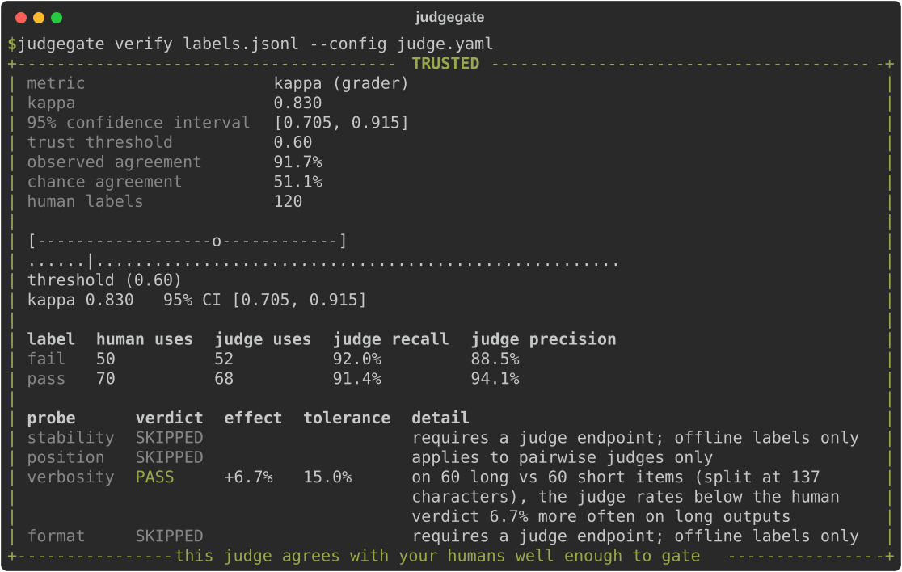
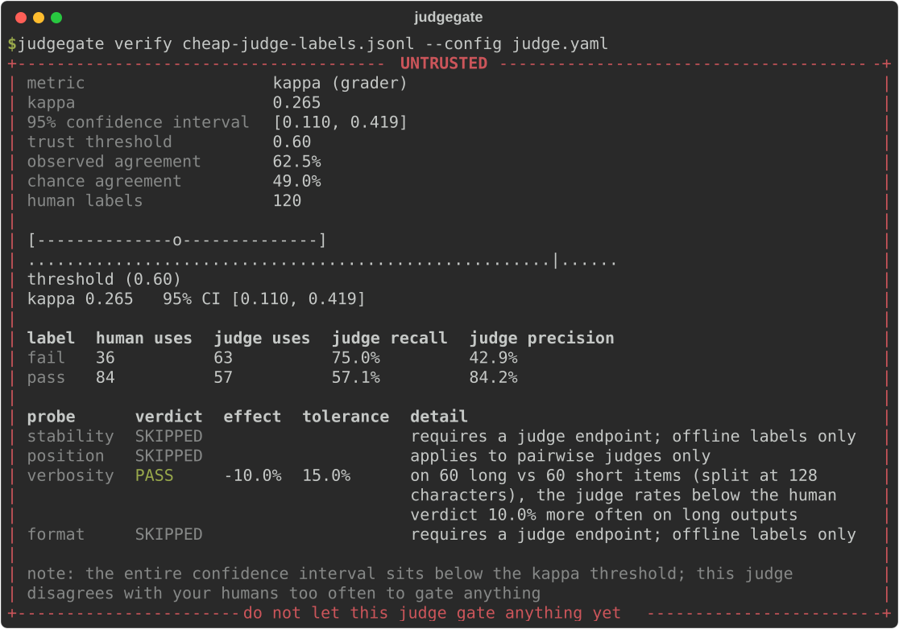
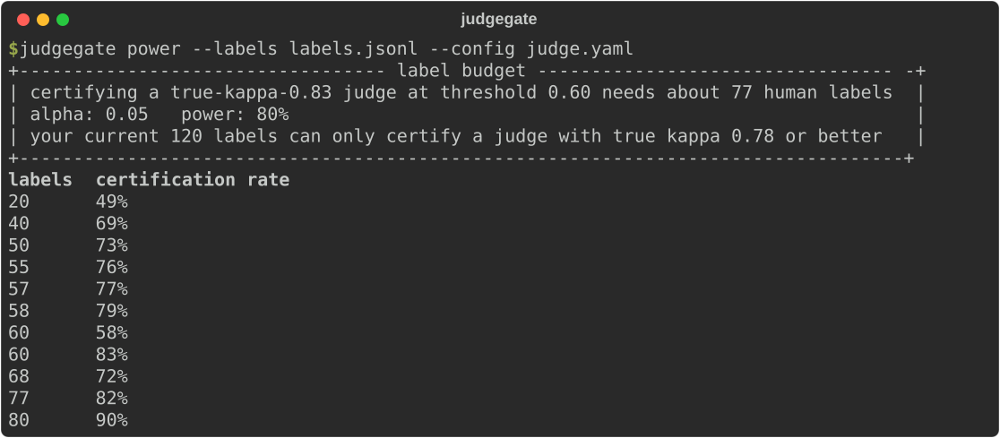
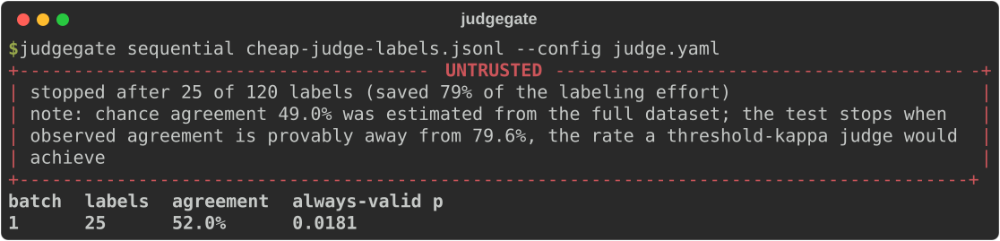

# judgegate

**A CI trust gate for LLM judges.**

[](https://github.com/yashchimata/judgegate/actions/workflows/ci.yml)
[](https://pypi.org/project/judgegate/)
[](pyproject.toml)
[](LICENSE)

You gate releases on an LLM judge's scores. Has anyone checked the judge?

Most teams adopt LLM-as-judge, write a grading prompt, eyeball a few
verdicts, and start trusting it in CI. From then on every ship or block
decision inherits whatever biases and noise the judge carries. judgegate
measures the judge itself against your human labels and refuses to let an
unreliable judge gate your pipeline.



| Verdict | Exit code | Meaning |
|---|---|---|
| `TRUSTED` | 0 | The judge agrees with your humans well enough to gate, and no probe failed. |
| `UNTRUSTED` | 1 | The judge disagrees too much, or a bias probe failed outright. |
| `INCONCLUSIVE` | 2 | Not enough human labels to certify or reject, reported with the label count that would decide it. |

Operational failures (bad files, bad flags, endpoint errors) exit with
code 3, so a pipeline can always distinguish "the gate decided" from "the
gate broke".

judgegate is pure Python, works with any OpenAI-compatible endpoint, caches
every judge call in SQLite so reruns are free, sends nothing anywhere
except to the judge endpoint you configure, and runs **fully offline** when
your labels file already contains the judge's answers.

## Install

```bash
pip install judgegate
```

## Sixty second tour

The repository ships example data, so every command below works on a fresh
clone with no API key.

**1. Verify a judge.** Agreement is measured with Cohen's kappa (chance
corrected, unlike raw percent agreement) and a bootstrap confidence
interval, then compared against your trust threshold:

```bash
judgegate verify examples/labels.jsonl --config examples/judge.yaml
```

That is the TRUSTED screenshot above. Against a judge that flips verdicts
too often, the same command refuses:



**2. Ask the label budget question.** Human labels are the most expensive
part of judge validation. This command turns "how many do we need" from a
guess into arithmetic:

```bash
judgegate power --labels examples/labels.jsonl --config examples/judge.yaml
```



**3. Stop labeling early.** Sequential mode replays your labels through
always-valid stopping boundaries and shows where the labeling effort could
have stopped:

```bash
judgegate sequential examples/labels.jsonl --config examples/judge.yaml
```



**4. Pre-flight any labels file** with `judgegate validate labels.jsonl`.

## The labels file

One JSON object per line. Either `score`-style grading or pairwise
comparison:

```json
{"id": "q-001", "input": "What is a mutex?", "output": "A lock that...", "human_label": "pass", "judge_label": "pass"}
{"id": "q-002", "input": "Capital of France?", "output": "Lyon.", "human_label": "fail", "judge_label": "pass"}
```

`human_label` comes from your annotators. `judge_label` is optional: when
every row has one (exported from your existing eval logs), judgegate runs
completely offline. When missing, judgegate calls the judge configured in
`judge.yaml` and caches every response. Pairwise judges use `output_a` and
`output_b` with labels `a` and `b`. Full schema in
[docs/labels-format.md](docs/labels-format.md).

## The probe battery

Agreement alone can hide systematic bias, so `verify` also runs probes,
each with an effect size, confidence interval, and configurable tolerance:

- **stability**: rerun the judge on identical inputs and count changed
  verdicts
- **position**: swap the two candidates of a pairwise judge and check the
  verdict follows the content, not the slot
- **verbosity**: fully offline check for whether output length sways the
  judge relative to humans
- **format**: strip markdown decoration and check the verdicts hold

A failed probe forces UNTRUSTED regardless of how good the kappa looks,
because a biased judge with high average agreement is still exploitable.
`judgegate probe` runs the battery on its own.

## Use it as a pull request gate

```yaml
jobs:
  judge-gate:
    runs-on: ubuntu-latest
    permissions:
      pull-requests: write
    steps:
      - uses: actions/checkout@v7
      - uses: yashchimata/judgegate@v0.1.0
        with:
          labels: evals/judge-labels.jsonl
          config: evals/judge.yaml
```

The action posts a sticky comment with the verdict, kappa error bar, and
probe table, updates it in place on every push, and fails the check only
on UNTRUSTED (or on INCONCLUSIVE if you set `fail-on-inconclusive: true`).
Details in [docs/github-action.md](docs/github-action.md). GitLab CI users: see [docs/gitlab-ci.md](docs/gitlab-ci.md).

**See it live:** this repository gates its own example judge on every pull
request; the [open demo pull requests](https://github.com/yashchimata/judgegate/pulls?q=is%3Apr+is%3Aopen+label%3Ademo)
show a real TRUSTED comment and a real UNTRUSTED with a failed check.

## Configuration

Everything lives in one `judge.yaml`:

```yaml
judge:
  endpoint: https://api.openai.com/v1
  model: gpt-4o-mini
  api_key_env: OPENAI_API_KEY
  temperature: 0.0
  prompt: |
    You are grading whether an answer is factually correct.
    Question: {input}
    Answer: {output}
    Respond with JSON only: {"label": "pass"} or {"label": "fail"}.
  extraction:
    method: json_field
    field: label

labels:
  values: [fail, pass]

gate:
  min_kappa: 0.6
  alpha: 0.05
  power: 0.8
```

`min_kappa` is the heart of the policy. Kappa of 0.6 is a common bar for
substantial agreement; where to set yours depends on what the judge gates.
The full reference, including probe tolerances and weighted kappa for
ordinal labels, is in [docs/configuration.md](docs/configuration.md).

## How the statistics work

Short version: Cohen's kappa (or weighted kappa for ordinal labels)
measured against human labels, a bias-corrected bootstrap confidence
interval resampled at the item level, a decision rule on the interval
rather than the point estimate, simulation-based power analysis for the
label budget, and a mixture SPRT for the sequential mode. The long
version, with the reasoning behind each choice and the known limitations,
is in [docs/methodology.md](docs/methodology.md). The test suite includes
calibration checks that verify interval coverage and certification rates
against synthetic judges with known true agreement.

## Works well with statgate

judgegate validates the judge; [statgate](https://github.com/yashchimata/statgate)
turns eval scores into statistically calibrated ship or block decisions.
Together they cover both halves of trusting an eval pipeline: first prove
the judge deserves the job, then gate changes on what it reports.

## Python API

```python
from pathlib import Path

from judgegate import Verdict, evaluate_gate, load_config, load_examples
from judgegate.judge import resolve_judge_labels

config = load_config(Path("judge.yaml"))
examples = load_examples(Path("labels.jsonl"))
labels = resolve_judge_labels(examples, config, client=None)
report = evaluate_gate(examples, labels, config)

print(report.verdict, report.agreement.kappa, report.labels_needed)
if report.verdict is not Verdict.TRUSTED:
    raise SystemExit(report.exit_code)
```

## Development

```bash
git clone https://github.com/yashchimata/judgegate
cd judgegate
python -m venv .venv && . .venv/bin/activate   # .venv\Scripts\activate on Windows
pip install -e ".[dev]"
pytest
ruff check src tests scripts
mypy src
```

Contributions are welcome. See [CONTRIBUTING.md](CONTRIBUTING.md) and the
[good first issues](https://github.com/yashchimata/judgegate/issues?q=is%3Aissue+is%3Aopen+label%3A%22good+first+issue%22).

## License

[MIT](LICENSE)
